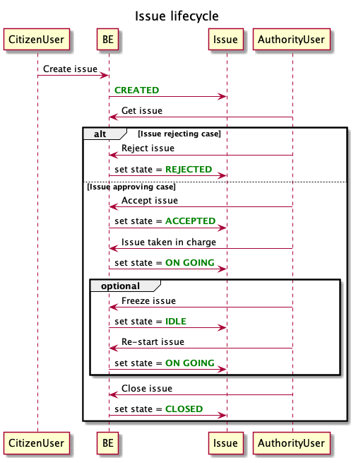

# E-Municipal entities
This document defines and explains meaning of all entities provided by e-municipal plaftform

## User
In this application there are three different types of user: 
- **Citizen user**: it can create an account, submit a new issue, update an existing issue, rates other issues, close (with explanation) its issues.
- **Authority user**: its account has been created by admin user. It takes charge of new opened pending issues, accept/reject its taken charge issues (with explanation), advance status of issues (with explanation).
- **Admin user**: it have all permissions for example, create users, handle issues etc.

## Issue
An issue is a core concept of e-municipal application. It models a real problem in a given e-municpal area, that is advertised by citizen user and handled by authority users. 
The issue lifecycle is punctuated by its state, and each state changing is tracked in this platform.

## Municipal area
*[TBD]*

## Topic
*[TBD]*